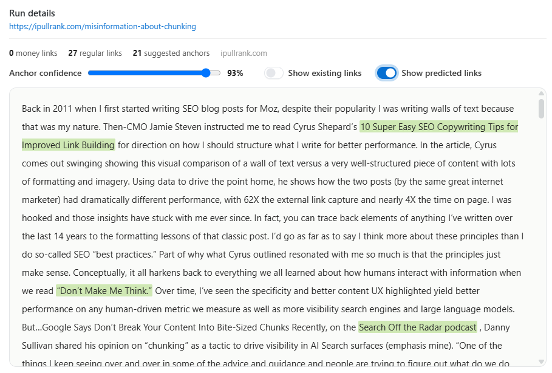
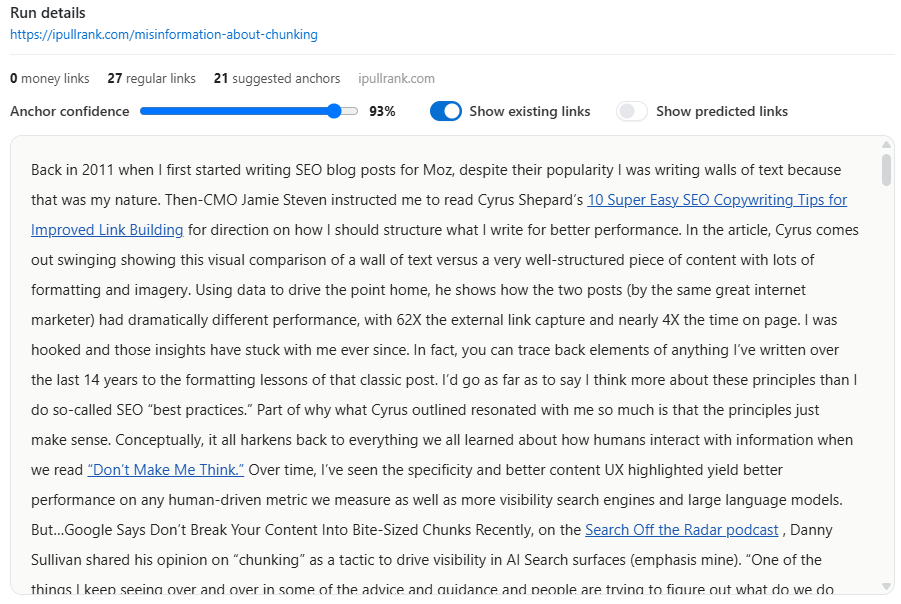
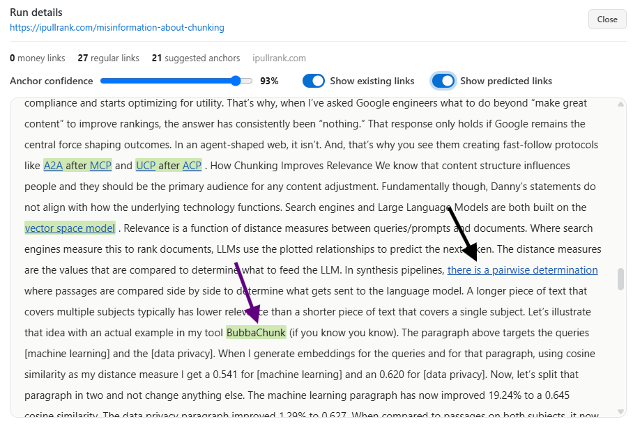
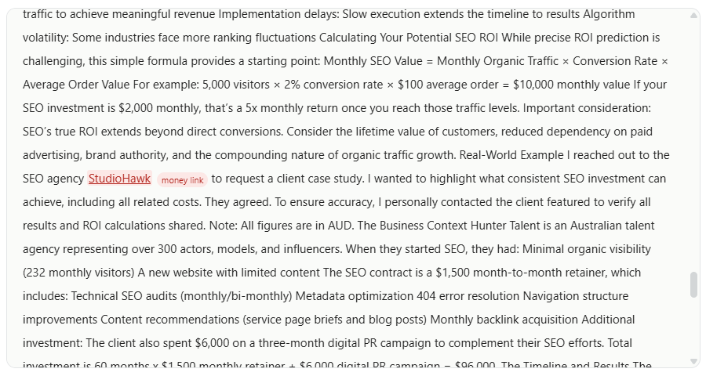

# Link Building & Outreach for AI Search 

 [

Dan Petrovic](https://dejan.ai/u/5) · 06 October 2026  

Natural linking follows predictable human patterns that deep learning models and search algorithms easily detect, exposing inorganic link building efforts. 

  [Read](https://dejan.ai/blog/outreach/) [Listen](https://dejan.ai/blog/outreach/listen/) [Watch](https://dejan.ai/blog/outreach/watch/)   markdown_copyCopy Article   

Large language models are expensive to train.

A typical commercial model is already months out of date

Knowledge Cutoff is the date after which a language model has no built-in knowledge, because its [training data](https://dejan.ai/concepts/training-data/) stops there. Anything later is unknown to the model unless it is supplied at request time, so from memory alone a model cannot reliably answer questions about events, prices, or releases past that point. 

The cutoff is a property of the trained weights, distinct from the current date. A model can know today's date and still hold a world frozen months or years earlier. This is the gap that [grounding](https://dejan.ai/concepts/grounding/) and [retrieval-augmented generation](https://dejan.ai/concepts/retrieval-augmented-generation/) exist to close: when a question turns on recent facts, the system runs a live search and answers from retrieved pages rather than from its stale prior. Asked about recent events without retrieval, a model is prone to [hallucinate](https://dejan.ai/concepts/hallucination/) a plausible but wrong answer. 

For AI visibility the cutoff is why [fresh, current content](https://dejan.ai/concepts/content-freshness/) earns a place in answers a model cannot produce from memory. A brand, product, or fact that postdates the cutoff exists for the model only through what it can retrieve, which puts a premium on being crawlable and citable at the moment the question is asked. on its very release date and the knowledge it comes with

Parametric Memory is the knowledge a model holds in its own weights, learned during [pre-training](https://dejan.ai/concepts/pre-training/) and recalled in a single forward pass with no lookup and no retrieval. Lewis et al. named it in the 2020 RAG paper to separate it from non-parametric memory, the external index a system searches at request time and loads into the [context window](https://dejan.ai/concepts/context-window/). 

## Where the knowledge sits 

Facts are spread across the weights rather than held in addressable records. Geva et al. (2021) showed that the feed-forward layers of a transformer work as key-value memories: each key pattern responds to a class of inputs, and the paired value shifts the output distribution toward particular [tokens](https://dejan.ai/concepts/token/). [Mechanistic interpretability](https://dejan.ai/concepts/mechanistic-interpretability/) work such as ROME (Meng et al., 2022) traces a single factual association to a small set of middle-layer MLP weights and rewrites it there, which shows the storage is localised enough to change one fact at a time. 

## How much fits 

Allen-Zhu and Li (2024) measured knowledge capacity at about 2 bits per parameter when each fact appears around 1,000 times in training, falling to about 1 bit per parameter at 100 exposures. At the 2-bit figure a 7-billion-parameter model holds roughly 14 billion bits, near 1.75 GB, of factual content. Exposure count is the binding constraint: a fact seen a few times in the [training data](https://dejan.ai/concepts/training-data/) is encoded weakly or not at all, while one repeated across many sources is recalled reliably. 

## Frozen at the cutoff 

Parametric memory is fixed when training stops, which is what the [knowledge cutoff](https://dejan.ai/concepts/knowledge-cutoff/) describes. Changing it takes [fine-tuning](https://dejan.ai/concepts/fine-tuning/), a further pre-training run, or targeted weight editing, and none of those run per query. Anything later reaches the model only through [grounding](https://dejan.ai/concepts/grounding/) or [retrieval-augmented generation](https://dejan.ai/concepts/retrieval-augmented-generation/), which supply text at [inference](https://dejan.ai/concepts/inference/) and leave the weights untouched. 

## Failure mode 

A query that lands on a weakly encoded fact still returns fluent text, because generation samples the most probable continuation whether or not the knowledge is present. That is the mechanism behind [hallucination](https://dejan.ai/concepts/hallucination/): the weights carry no separate signal for "this was never stored". 

## Parametric memory and AI visibility 

A brand that appears widely and consistently across the training corpus is answered from parametric memory, with no retrieval step and no citation attached. A brand that does not exists for the model only when it can be retrieved, which puts the weight on crawlability and [freshness](https://dejan.ai/concepts/content-freshness/). The two paths produce different results in an AI answer: parametric recall returns a claim with no link back to a source, while retrieved content can be cited. 

## Related concepts  
- [Pre-training](https://dejan.ai/concepts/pre-training/) 
- [Training Data](https://dejan.ai/concepts/training-data/) 
- [Knowledge Cutoff](https://dejan.ai/concepts/knowledge-cutoff/) 
- [Retrieval-Augmented Generation](https://dejan.ai/concepts/retrieval-augmented-generation/) 
- [Grounding](https://dejan.ai/concepts/grounding/) 
- [Hallucination](https://dejan.ai/concepts/hallucination/) 
- [Fine-tuning](https://dejan.ai/concepts/fine-tuning/) 
- [Mechanistic Interpretability](https://dejan.ai/concepts/mechanistic-interpretability/)  is fuzzy at best. Retrieval remains the dynamic memory layer of all AI assistants and the most significant type is grounding with organic search

Web search grounding is the process where an AI model answers a fact-seeking question not from memory but by running its own web search, reading what comes back, and weaving some of those pages into its reply. It's the umbrella term for how Google, OpenAI and Anthropic pull live sources into generated answers. 

Under the hood every platform runs the same funnel: a search returns pages received, a subset have readable content, and a smaller subset get cited in the answer. The gap between received and cited is where each platform's personality shows. In our head-to-head test on a single query, Google received 7 pages and cited all 7, OpenAI received 39 and cited just 2, and Anthropic received 14 and cited 9. 

For AI visibility this is the whole game: your page has to survive the funnel — get retrieved, be readable, and earn the citation. It works through [grounding chunks](https://dejan.ai/concepts/grounding-chunk/) and the [grounding snippet](https://dejan.ai/concepts/grounding-snippet/), and it is distinct from [document grounding](https://dejan.ai/concepts/document-grounding/), where you hand the model a specific URL. 

## Related concepts  
- [Grounding](https://dejan.ai/concepts/grounding/) 
- [Grounding Chunk](https://dejan.ai/concepts/grounding-chunk/) 
- [Document Grounding](https://dejan.ai/concepts/document-grounding/) 
- [Number of Citations](https://dejan.ai/concepts/number-of-citations/) . This means that AI visibility and organic search

[memory-grounding] have a very strong link. Strong links. Nice. Let's talk about that now.

SEOs and link builders strategize and debate various angles and nuances of outreach methods, build outreach databases and systems, they look at metrics (DAPA DRAPA...) good links are being refused because they don't meet a number made up by a SaaS company that has nothing to do with Google's link authority and approximates it at best. Hell, we've got one

AI Brand Authority Index: Ranking 2.9 Million Brands by Associative Embeddedness in Gemini’s Memory

This research presents a methodology for quantifying brand authority in large language model memory using Personalized PageRank and directed association graphs.[Read Full](https://dejan.ai/blog/brands/) too!

So all this work and thinking goes into it and then we ruin it at the end with one simple thing that happens almost every single time.

## Incongruence.

Show me any of your outreach based links, articles, posts and such and I will be able to tell you who wanted the link on that page.
- I will be able to tell
- Any experienced SEO or link builder will be able to tell
- Google's web spam team will be able to tell
- Google's models and algorithms will be able to tell

This problem of poor link integration has plagued the industry for two decades now and the same is happening with inorganic mentions in the age of AI search. So much time, energy and money going to waste.

Have a quick play with the following data visualisation to lock in on one important context. As people read a piece of content, they'll feel varying degrees of desire for a link:

[link-desire]

Knowing where to place links is a skill that refines with time and most senior journalists and bloggers don't even think about it. What do you call that?

Intuition.

All experienced web authors link out to other pages in almost identical ways. It's as if there's an optimal way that links should be and millions of experienced web authors do it in the same or very similar way. Linking habits as a stable and predictable element of human behaviour.

I've collected gigabytes of data and billions of tokens worth of link patterns in both organic and inorganic link patterns. I've then trained a deep learning model on these user behaviour signals and now have a model that can predict user behaviour. When I show it plain text, it simply knows where the human will place the links on it. It's a model with human-level intuition for natural link integration.

Let's zoom in from abstract to precise now. Here's our [link analysis](https://app.dejan.ai/property/43?tab=content_optimizer&sub=link_optimizer&lo_run=29) of Mike's chunking article. Mike is a domain expert with many years of blogging experience. Can you guess which spans of text are his links?

Back in 2011 when I first started writing SEO blog posts for Moz, despite their popularity I was writing walls of text because that was my nature. Then-CMO Jamie Steven instructed me to read Cyrus Shepard’s 10 Super Easy SEO Copywriting Tips for Improved Link Building for direction on how I should structure what I write for better performance. In the article, Cyrus comes out swinging showing this visual comparison of a wall of text versus a very well-structured piece of content with lots of formatting and imagery. Using data to drive the point home, he shows how the two posts (by the same great internet marketer) had dramatically different performance, with 62X the external link capture and nearly 4X the time on page. I was hooked and those insights have stuck with me ever since. In fact, you can trace back elements of anything I’ve written over the last 14 years to the formatting lessons of that classic post. I’d go as far as to say I think more about these principles than I do so-called SEO “best practices.” Part of why what Cyrus outlined resonated with me so much is that the principles just make sense. Conceptually, it all harkens back to everything we all learned about how humans interact with information when we read “Don’t Make Me Think.” Over time, I’ve seen the specificity and better content UX highlighted yield better performance on any human-driven metric we measure as well as more visibility search engines and large language models. But…Google Says Don’t Break Your Content Into Bite-Sized Chunks Recently, on the Search Off the Radar podcast , Danny Sullivan shared his opinion on “chunking” as a tactic to drive visibility in AI Search surfaces (emphasis mine).

Here's our model's predictions at 93% confidence threshold:

And here are Mike's actual links:

Oh, I'm getting goosebumps. It's as if it read Mike's mind!

### Our deep learning model can tell organic and inorganic links apart and so can Google's. Forget about DAs and PAs. Poor link integration is what kills all value of your outreach efforts.

Sure. It's not always perfect. Sometimes the model will miss a link prediction (e.g. there is a pairwise determination) and sometimes it will flag something that should be a link, but isn't (e.g. BubbaChunk), see below.

Why am I showing you all this? I'm reinforcing a notion that there's a natural order of things on the web and everything falls into a pattern. Links included. Google's web spam and search quality algorithms and language models are literally designed for pattern matching.

### Inorganic links and mentions get caught when they sit where no reader wanted or expected them. Experienced writers place links by instinct, in patterns stable enough for a model to predict, and links and mentions that break those patterns stand out to both algorithms and human reviewers.

Now here's a real curveball.

Let's pick someone with two decades of blogging experience and thousands of blog posts, someone whose links are completely natural and effortless, a second nature. Seth Godin. Pay him $10,000 and ask to write a piece with a link to your page. I almost guarantee you he would fail at his usual natural link integration and so would most of you who are reading this. Why?

### Because as soon as your link becomes the primary goal, the content becomes secondary. Links should be there in support of content, not the other way around.

So you're reading this and thinking, I can do better, I can be clever about this. I can integrate my links so they fit the content perfectly. But see, the SEO industry has already poisoned the web content community with the 1 + 2 rule. One money link plus a couple of authority links to 'make it look natural'. Here's my experience with a brainwashed publisher. These guys charge a $150 editorial fee, with the following requirements:

Only one commercial link is allowed. It should look natural and not spammy. No adult and gambling sites! Include 1-3 Authority links to well-ranked news, government or similar sites.

Ironically the 1 + 2, works against the very thing it asks for. It:
- Makes the post look less natural.
- Aids algorithmic detection.
- Provides a pattern for manual actions.
- Creates a negative user experience.
- Encourages poor link integration.

Fun Fact: Organic content often contains 10-20 links on a page, while classic blog networks tend to be quite stingy with 2-3 links per post.

## Four rules for links that read as editorial

### Liberal linking

Link to every page that helps the reader, on every relevant domain, including domains you have no stake in. This is the habit the 1 + 2 formula breaks.

 | 

Signal | 

Question to ask

 | 

Coverage | 

Does the page link to the sources, terms and entities a reader may want to follow?

 | 

Openness | 

Does it link to other domains as readily as to its own?

 | 

Consistency | 

Does its link density match the host site's editorial posts?

 | 

Independence | 

Would the links still be there if no link had been paid for?

 | 

Blend | 

Does any single link stand out from the rest?

### Purpose

Every link must have a strong purpose. There are ten: attribution, reference, definition, expansion, identification, example, action, relationship, proof and promotion. Yes, promotion is on the list. A commercial link is fine when it passes the same test as every other link on the page.

 | 

Purpose | 

What the link does for the reader

 | 

Attribution | 

Credits the person or outlet behind a quote, image or idea

 | 

Reference | 

Points to the source of a fact or figure

 | 

Definition | 

Explains a term the reader may not know

 | 

Expansion | 

Gives more depth on a point the text only touches

 | 

Identification | 

Shows exactly which person, company, product or place is meant

 | 

Example | 

Shows an instance of what the text describes

 | 

Action | 

Lets the reader do something, such as buy, sign up or download

 | 

Relationship | 

Connects the subject to a related person, organisation or story

 | 

Proof | 

Backs a claim with evidence

 | 

Promotion | 

Points to something the publisher or a partner wants to promote

### Primacy

A link must lead to the strongest possible page for that spot, judged by logic, situation, narrative, utility and relevance. If a better page exists for the anchor, the link is in the wrong place.

 | 

Test | 

Question to ask

 | 

Logic | 

Is this the page the anchor text promises?

 | 

Situation | 

Does it suit what the reader needs at this point?

 | 

Narrative | 

Does it continue the story the article tells?

 | 

Utility | 

Is it the most useful page on the subject?

 | 

Relevance | 

Does it match the sentence the link sits in?

### Natural anchor text

If your anchor text fits the natural pattern of existing anchor text on that site, your link will be near impossible to devalue or penalise.

 | 

Signal | 

Question to ask

 | 

Pattern fit | 

Does the anchor match how the host site phrases its own links?

 | 

Plain wording | 

Does it describe the source or the action, with no target keyword?

 | 

Grammar | 

Does it read as a natural part of the sentence?

 | 

Rarity | 

Is the exact phrase uncommon, like most anchors in the long tail?

 | 

Click point | 

Does it sit on the words a reader would expect to click?

## Content first, links second

The better the content, the less link-building effort it needs. Step zero is to create value: if there's nothing worth linking to, no linking technique will fix that. Then:
- As a starting point, focus on content.
- Consider all that is of value and where it lives.
- Write and link out generously to the best pages, on all relevant domains and in tune with your readers' expectations.

## Placement

The principles above still fail when one line in the text exists only to carry a link. That single line in the wrong place is enough to expose the link.

As a reader moves through a text, their desire for a link rises and falls. It peaks where the text names a source, makes a claim or mentions something the reader may want to look up. A natural link sits at one of those peaks.

How many peaks get a link depends on the threshold. Linking only the absolute essentials gives the fewest links, a conservative threshold gives more, and a liberal threshold gives the most.

Take a client link placed in a story that gives the reader no reason to want it. Even if the story did call for a link at that point, the client's page would not be the strongest target. This is the links-as-an-afterthought pattern, where content is written to carry a link.

WARNING: The above is much easier said than done, and you only realise that once you sit down and try to do it yourself. There's this psychological phenomenon that drives people to claim that their link integration is "good enough" because they just put work into it and don't feel like doing more of it. The only way to fix this is to ask another SEO the following:

Who wanted the link/mention on this page?

If they can guess your link correctly, then it's not good enough.

## Inorganic Link Detection

Some websites (you know the type

) make it trivially easy to detect inorganic placements with severe topical incongruence and obvious link integration. But there are many sophisticated methods which are easy to miss by a human but a perfect job for a machine. Here's my paid link detection algorithm in action:

Now, algorithms get things wrong all the time so I shall pass no judgement here and leave the final verdict [to you](https://app.dejan.ai/property/43?tab=content_optimizer&sub=link_optimizer&lo_run=32), the reader. But the point I'm making is that if our algorithm can detect this type of thing, then so can Google's, and for this reason most outreach-based links are ignored, or treated as a small negative signal.

Update: The agency Chief of Staff, Lawrence Hitches, has reached out to us to clarify that this was a completely natural link and that our algorithm got it wrong. Our audit of this false positive reveals the underlying reasons this link was flagged by our algorithm.

The flagged outbound link mainly trips the Blend and Independence signals. It is the only external editorial link in the whole post, while Hunter Talent, the business the case study is actually about, gets no link at all.

 | Article signal | How the flagged link trips it

 | Blend | The only outbound editorial link on a page that otherwise links internally or to the site owner’s products, so it stands out

 | Openness / Independence | No other third party is linked, which suggests the link exists because of the arrangement, not reader need

 | Placement (link desire) | The reader’s desire peaks at Hunter Talent and the results, not at the provider’s name; the link sits off-peak

 | Primacy | A link to the specific case study page would be stronger than a homepage

 | “Who wanted the link?” | Any SEO would guess the linked provider immediately

Clumsy integration ruins what could be truly great links. Even seasoned link builders struggle to make things fit. We're simply not subject matter experts at every single thing and a lot of outreach content that gets pumped out is, how should I put it.... uninspired.

So, how do I solve this?

## Adversarial Link Integration

We use an outreach workflow in [app.dejan.ai](https://app.dejan.ai/property/43?tab=outreach) that simultaneously battles our two algorithms. It puts two AI teams up against each other. The red team researches the topic, writes the article and places your link. The blue team is our paid link detector, and its only job is to find the link someone paid for. If it finds it, the article is discarded.

[adversarial-flow]

Only articles the detector can't crack make it to our outreach content library.

Click to see a more detailed version

Press "Play" to see it in action.

[adversarial-loop].

Tools: [Link Optimizer](https://app.dejan.ai/property/43?tab=content_optimizer&sub=link_optimizer), [Adversarial Link Integration](https://app.dejan.ai/property/43?tab=outreach)

To be [continued](https://lnkd.in/p/gnhmkFbP). 

## Related concepts  
- [AI Influence](https://dejan.ai/concepts/ai-influence) 
- [E-E-A-T](https://dejan.ai/concepts/e-e-a-t) 
- [Knowledge Cutoff](https://dejan.ai/concepts/knowledge-cutoff) 
- [Link Building](https://dejan.ai/concepts/link-building) 
- [Outreach](https://dejan.ai/concepts/outreach) 
- [Parametric Memory](https://dejan.ai/concepts/parametric-memory) 
- [Source Authority](https://dejan.ai/concepts/source-authority) 
- [Web Search Grounding](https://dejan.ai/concepts/web-search-grounding)    
